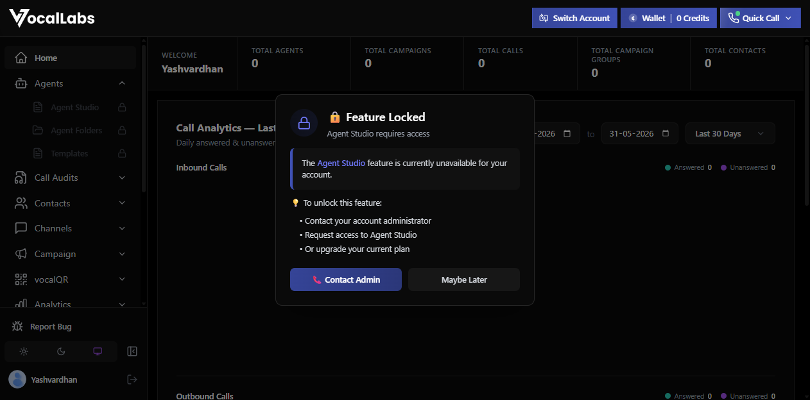
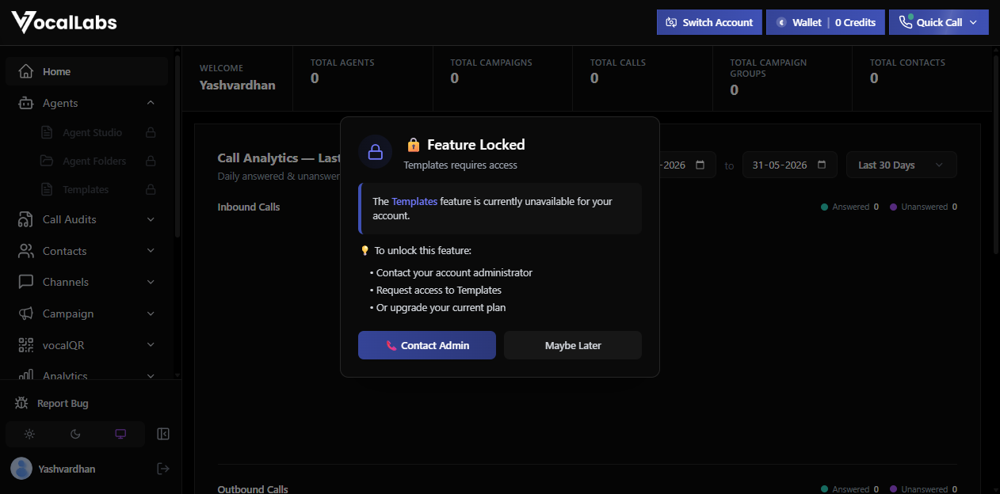
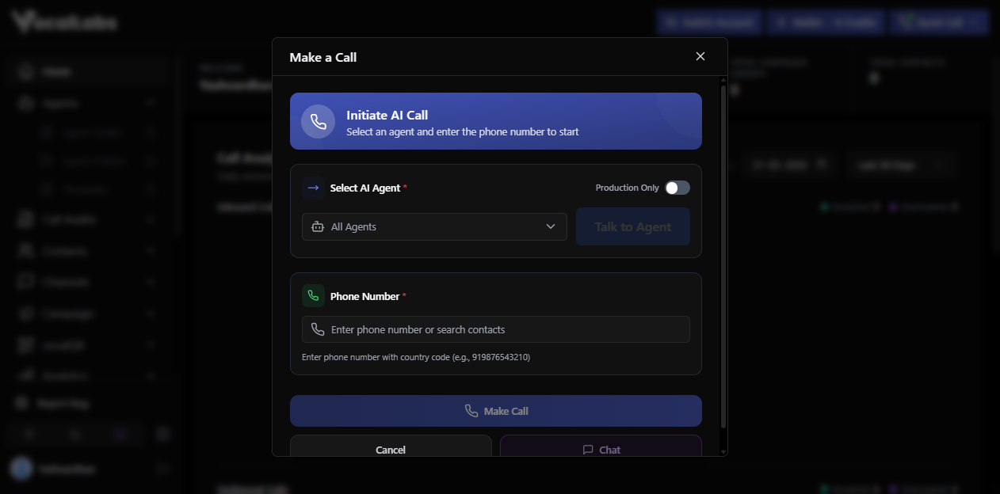
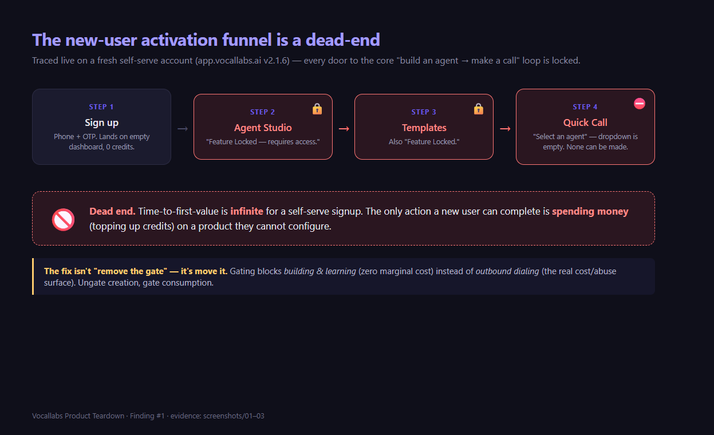
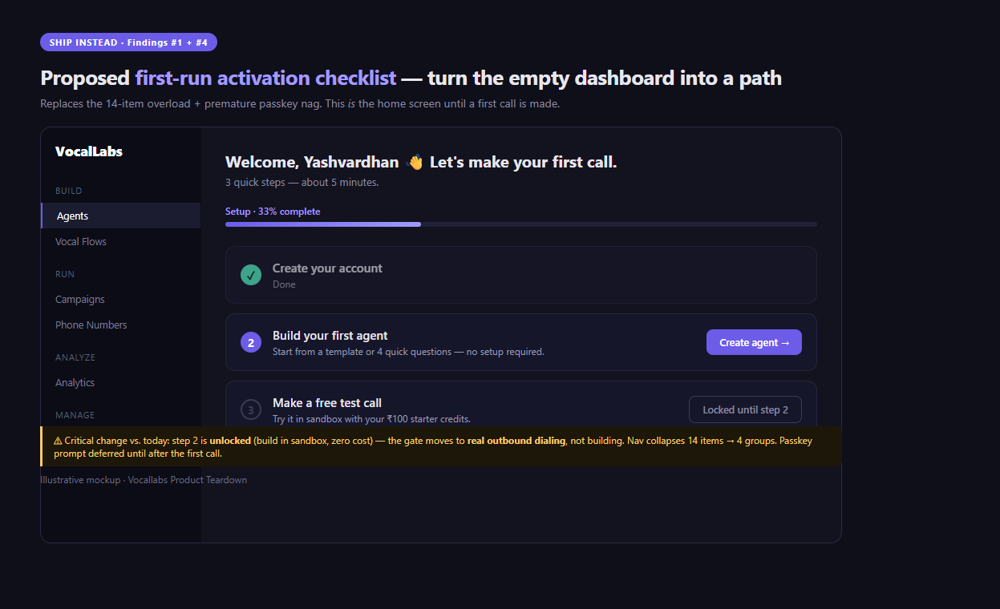
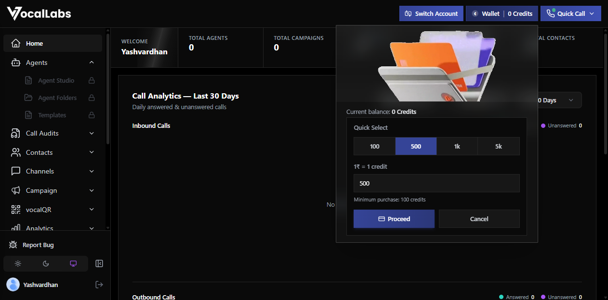
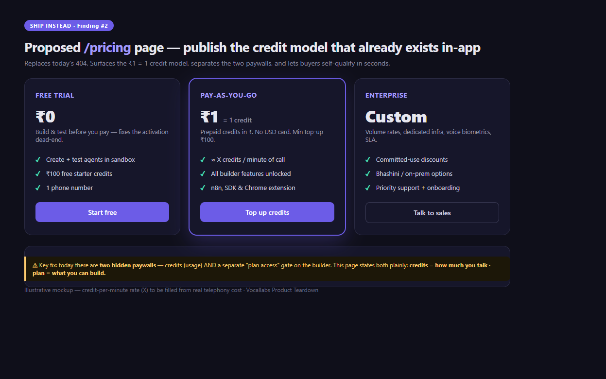
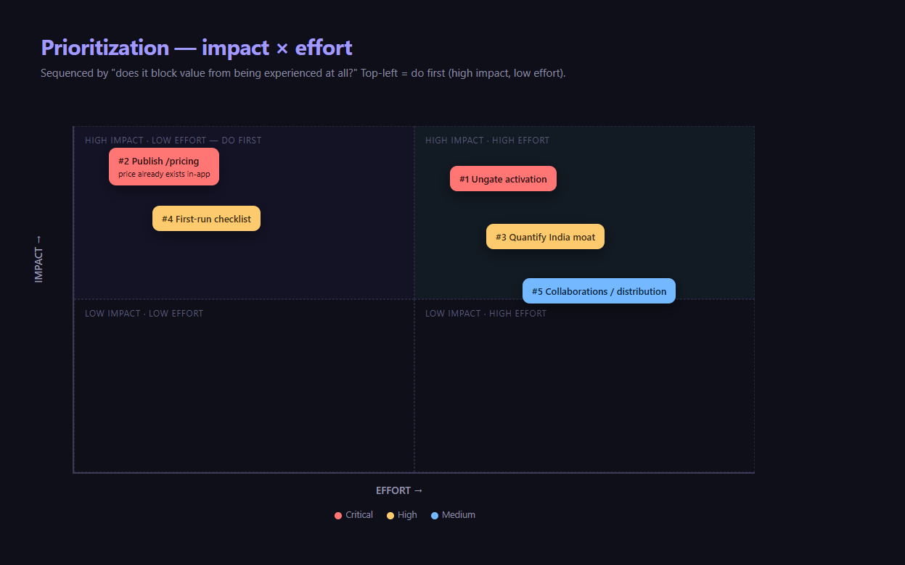

# Vocallabs.ai, Product Teardown

**By:** Yashvardhan Singh • **Date:** 31 May 2026 • **For:** Vocallabs Product (Intern to PPO task)
**Surfaces used:** `vocallabs.ai` (marketing), `app.vocallabs.ai` (logged-in product, fresh account), `docs.vocallabs.ai` (API)

> **How to read this:** 5 feedbacks, one per product pillar (GTM, Pricing, Competition, UX, Collaborations), each as Observed, Problem, Ship instead, ordered by priority. Every claim is either screenshotted (`screenshots/`) or cited (`research/`). The honest one-liner: the technology looks strong, but a brand-new user cannot actually use it. Activation is broken before value is ever seen.

---

## Methodology (so you know I actually used it)

I signed up as a real self-serve user (phone-OTP), landed in the dashboard with 0 credits, and tried to do the one thing the product exists for: build an agent and make a call. I could not, and that journey is the teardown. I also read the public API docs (to find the monetization model the website hides) and benchmarked 8 competitors including the India-native players, since "India-first" is the stated moat. Supporting evidence: [`screenshots/`](screenshots/) and [`research/`](research/).

**Scope boundary (deliberate):** because the locked builder prevented me from ever placing a call, I could not assess the product's actual voice quality, the "human-like fluency," the emotion/intent/tone analytics, or the hybrid AI-to-human handoff that the brief sells. This teardown is therefore about the **activation funnel**, the journey that decides whether anyone reaches those features at all. That is the right place to look first: if new users can't get in, the quality of what's inside never gets evaluated by them either.

---

## TL;DR, the 5 feedbacks, prioritized

| # | Pillar | Feedback | Severity | Effort |
|---|--------|----------|----------|--------|
| **1** | Features / Activation | New self-serve users hit **"Feature Locked"** on the agent builder; the core loop is unreachable | Critical | Med |
| **2** | GTM / Pricing | Public **`/pricing` 404s**, yet a real **₹1 = 1 credit** model lives in-app, with **two separate paywalls** | Critical | Low |
| **3** | Competition / Positioning | The **"India-first" moat is asserted, unquantified, and out-gunned on paper** by Sarvam/Gnani/Smallest | High | Med |
| **4** | UX | Post-login you meet **14-item nav overload plus a passkey nag**, not guidance, at the exact moment you're already stuck | Med | Low |
| **5** | Collaborations | Real distribution assets (**n8n node, Chrome ext**) are buried, and the **India AI stack** (Bhashini/Sarvam) is unused | Med | Med |

---

## 1. Features / Activation: a new user literally cannot build an agent  `[Critical]`

### (a) Observed
On a fresh account I followed the only sensible path, create an agent, and hit a wall at every door:

- **Agents → Agent Studio → "Feature Locked. Agent Studio requires access. Contact your account administrator / upgrade your current plan."**
  
- **Agents → Templates → also "Feature Locked."** All three Agents sub-items (Studio, Folders, Templates) show a lock icon in the sidebar.
  
- **Quick Call → AI Agent Call →** modal says *"Select an agent and enter the phone number to start"*, but the agent dropdown shows only an "All Agents" placeholder with nothing to select (the dashboard reads **TOTAL AGENTS: 0**, and none can be created). `Make Call` is therefore unreachable.
  

**The funnel, visualized:**

Sign up, try to build (locked), try a template (locked), try to call (needs an agent you can't make): **dead end.** The only action a new user can complete is spending money (topping up credits) on a product they cannot configure.

### (b) Problem
This is the single most damaging issue, because it nullifies everything upstream. Marketing can be perfect and it won't matter: **time-to-first-value is infinite for a self-serve signup.**
- It directly contradicts Vocallabs' own distribution strategy. An SDK, an n8n node, and a Chrome extension all scream product-led and self-serve, but the product gates the first step behind "contact an admin."
- Competitors weaponize the opposite: Retell gives **$10 free credits** and "go live in minutes"; Smallest.ai lets you **build a working agent in 5 minutes** by answering 4 questions. A developer evaluating all three will activate on the other two and never return.
- It silently dumps load on sales/support ("why can't I build an agent?") for users who should have self-served.

**Tradeoff I considered:** gating is probably intentional (abuse prevention, telephony cost control, or a sales-qualified motion). Fair. But the gate is in the **wrong place**: it blocks building and learning (zero marginal cost) instead of outbound dialing (the actual cost/abuse surface).

### (c) Ship instead
1. **Ungate creation, gate consumption.** Let anyone build an agent and test it in a sandbox (the "Production Only" toggle already exists in the call modal, lean on it). Require credits/verification only to dial real outbound numbers.
2. **One unlocked starter template plus a 5-minute guided "Create your first agent" flow** (Smallest-style: 4 questions to a working agent). Activation is the metric.
3. **If a hard gate must stay, make it self-clearing.** Today the lock offers a "Contact Admin" button, a dead-end for a self-serve user who *is* the admin and has no one to contact. Replace it with an in-app "Request access, instant approval for a verified email/UPI" path.

**Mockup of the fix, a first-run activation flow** (also addresses Finding #4):

---

## 2. GTM / Pricing: the price is a 404 on the web but a credit model in the app  `[Critical]`

### (a) Observed
- `vocallabs.ai/pricing` returns **HTTP 404** ([screenshot](screenshots/05-pricing-404.png)). No pricing appears anywhere on the public site.
- Yet **inside the app**, the Wallet reveals the real model: **"1₹ = 1 credit,"** top-up tiers 100/500/1k/5k, **minimum ₹100**.
  
- The API confirms a metered wallet (`wallet` / "Get Wallet Balance" endpoints, see [`research/docs-api.md`](research/docs-api.md)).
- **Two distinct paywalls appear to exist:** credits (usage) **and** a separate "plan/admin access" gate on Agent Studio. The lock copy ("upgrade your current plan") indicates that topping up credits alone would not unlock the builder. *Inference, not tested:* my account had 0 credits and I did not pay, so this is read from the lock copy rather than confirmed by purchasing. Either way it points to a confusing split worth fixing.

### (b) Problem
- **Self-serve buyers can't qualify themselves.** Retell ($0.07/min + $10 free), Bland ($0.09/min), and Smallest (₹/$49/$1,999) all let a prospect price the decision in seconds. Vocallabs forces a sales conversation for a number it has already decided (₹1/credit) and already shows logged-in users. Hiding it adds friction and signals "expensive/unsure," with zero upside.
- **The two-paywall split is genuinely confusing.** A user can pay ₹100, still be unable to build, and get no in-product explanation of why or how to gain "access." That is a refund/chargeback and trust risk.
- It also undercuts the **India-first** story: ₹-denominated, prepaid-credit pricing is a real local-market advantage (no forced USD card), and it is invisible to every prospect who hasn't already logged in.

### (c) Ship instead
1. **Publish the pricing that already exists, including the part even logged-in users can't compute.** A `/pricing` page with "₹1 = 1 credit, ₹100 minimum" plus the missing number: **credits burned per minute of call.** I could verify ₹1 = 1 credit and the ₹100 floor, but not the per-minute burn (no call could be placed), and a logged-in user can't compute it either. Publish the rate and a "1 minute ≈ X credits" calculator. This is a one-week content/marketing lift, not a strategy project.
2. **Collapse or clearly label the two paywalls:** "Credits = how much you talk. Plan = what you can build." If the plan gate stays, surface it on the pricing page with a self-serve upgrade path.
3. **Free starter credits** (mirror Retell's $10) so activation isn't blocked on a payment **and** a feature unlock simultaneously.

**Mockup, the `/pricing` page that should replace the 404:**

---

## 3. Competition / Positioning: "India-first" is asserted, not proven, and contested  `[High]`

### (a) Observed
- The homepage leads with **generic infrastructure specs**: "99.9% Uptime," "Sub-300ms," "Any Protocol. One API." These describe Twilio/Vapi too; they don't say why Vocallabs.
- The stated moat is **"India-first: tuned for local languages, accents & workflows,"** but the site **never quantifies it** (no language count, no accent/code-mixing demo, no benchmark).
- **No clear ICP.** The same site mixes developer messaging ("Any Protocol. One API," SDK) with business-buyer use-cases (FAQ/booking/collections bots) and enterprise infra claims, signalling "voice AI for everyone." For the GTM-and-ICP pillar this is the deeper miss: a prospect can't tell whether they (a solo developer, an SMB owner, or a BFSI buyer) are the intended customer.
- Meanwhile the India-native field is crowded and specific (full data in [`research/competitors.md`](research/competitors.md)):
  - **Sarvam AI:** 22 Indian languages, **government-backed** (GoI, Nvidia, Yotta), "pilot to production in under 24h."
  - **Gnani.ai:** 40+ languages including **12+ Indic**, **30M+ daily voice conversations**, enterprise voice biometrics.
  - **Smallest.ai:** 30+ languages, **under 100ms** TTS latency, transparent self-serve tiers.

### (b) Problem
The one thing that could differentiate Vocallabs is the one thing it doesn't substantiate. On paper, a buyer comparing tabs sees Sarvam's "22 languages plus govt backing" versus Vocallabs' unquantified "India-first," and Vocallabs loses the comparison it should win. Generic infra positioning also drops Vocallabs into a fight with Twilio (better global reach) and Retell/Bland (cheaper, transparent) where it has no edge.

### (c) Ship instead
1. **Quantify the moat, loudly:** "X Indian languages, Hindi-English code-mixing handled, regional-accent tuned" with a **30-second live audio demo** of a code-mixed call. Show, don't assert.
2. **Name one ICP and lead with it, instead of "enterprise voice AI for everyone."** Two credible options: (a) collections/BFSI like Skit.ai but self-serve, or (b) Indian SMBs (clinics, real-estate, coaching) that Sarvam/Gnani's 6 to 9 month enterprise motion ignores, and that the ₹-credit, self-serve model is perfect for. Pick one, put it in the hero, and let everything else be secondary.
3. **Reframe latency/uptime as proof points under an outcome headline**, not the headline itself ("Recover 30% more overdue payments" beats "Sub-300ms").

---

## 4. UX: login succeeds, then you meet overload instead of onboarding  `[Med]`

### (a) Observed
- The left nav carries **14 top-level items** (about 10 visible above the fold in the [dashboard screenshot](screenshots/06-dashboard-nav.png), the rest below it): Home, Agents, Call Audits, Contacts, Channels, Campaign, vocalQR, Analytics, Phone Numbers, Library, Transactions, Vocal Flows, EazyReach, Settings.
- **Three overlapping agent-ish surfaces:** "Agent Studio," "Vocal Flows," "Templates," with no explanation of how they differ.
- **Opaque brand-named features:** "vocalQR," "EazyReach," with no tooltip or first-run hint.
- A **"Secure Your Account / Enable Passkey" nag fires immediately**, before the user has created anything.
- No first-run checklist or guided setup anywhere.

### (b) Problem
This compounds Finding #1: at the precise moment a new user is already stuck behind a locked builder, the UI hands them maximum cognitive load and a security upsell for an account that contains nothing. It reads as a power-tool built for existing internal users, not for the self-serve developer the GTM is courting. High overwhelm, zero guidance, and a locked core add up to predictable early churn.

### (c) Ship instead
1. **A first-run activation checklist** ("1. Create agent, 2. Add a number, 3. Make a test call") that is the home screen until completed, turning the empty dashboard into a path.
2. **Group the 14 items into about 4 buckets:** Build (Agents/Flows/Templates), Run (Campaign/Channels/Phone Numbers), Analyze (Analytics/Call Audits), Manage (Contacts/Library/Transactions/Settings).
3. **Defer the passkey prompt** until after first value; **rename or tooltip** vocalQR/EazyReach so they're self-explanatory.

---

## 5. Potential Collaborations: distribution assets buried, India AI stack unused  `[Med]`

### (a) Observed
- Vocallabs **already ships an n8n community node** (confirmed: GitHub `Vocallabsai`) and a **Chrome extension**, but neither is surfaced as a growth/distribution lever in-product or on-site. No Zapier/Make presence found.
- The India-specific AI stack, **Bhashini** (Govt of India language initiative) and **Sarvam / AI4Bharat** models, is not leveraged, despite being the obvious accelerant for the "India-first" claim and for public-sector/BFSI procurement.
- Telephony/CPaaS incumbents with DLT compliance and installed base (**Exotel, Ozonetel**) and **WhatsApp** (via a BSP) are natural rails. Full analysis in [`research/collaborations.md`](research/collaborations.md).

### (b) Problem
A product whose GTM is self-serve/PLG, but which (per Finding #1) has no working self-serve activation **and** doesn't lean on its own distribution surfaces, has no growth engine at all. The collaboration assets that could compound, n8n template workflows and a Bhashini integration that unlocks government tenders, are sitting unused.

### (c) Ship instead
1. **Make the n8n node a real channel:** get it verified in the n8n registry and publish 3 to 5 template workflows ("AI call on new lead," "abandoned-cart COD confirmation call"). These are discovery surfaces, not just connectors.
2. **Integrate Bhashini** as an explicit option. It is a credibility and procurement unlock for gov/BFSI that global rivals structurally can't match.
3. **Channel play for the collections wedge** (Finding #3): partner with mid-size collection agencies and BPOs, leading with the hybrid AI-to-human handoff plus analytics so it augments rather than threatens their agents.

---

## Prioritization logic

I sequenced by "does it block value from being experienced at all?" then by effort:

Findings #1 (locked builder) and #2 (hidden pricing) are both Critical and both compound the same thesis: the **first mile is broken.** I keep them separate on purpose, one is product-gating, the other is pricing-discovery, and they have different owners and fixes, but together they are the reason a new user neither reaches value nor can judge whether it's worth paying for.

| Priority | Finding | Why first | Effort |
|---|---|---|---|
| **P0, this week** | #2 Publish pricing | The data already exists in-app; pure publish. Highest ROI per effort. | Low |
| **P0, this month** | #1 Ungate activation | Nothing else matters until a new user can reach value. | Med |
| **P1** | #4 First-run UX | Cheap, and multiplies the payoff of #1. | Low |
| **P1** | #3 Quantify India moat | Needs content and a demo asset; defines positioning. | Med |
| **P2** | #5 Collaborations/distribution | Compounding growth once #1 makes self-serve real. | Med |

## If I owned this from Day 1 (30 / 60 / 90)
- **30 days:** ship `/pricing` (#2); run an activation audit and ungate a sandbox agent plus 1 template (#1); add the first-run checklist (#4).
- **60 days:** instrument the activation funnel (signup, first agent, first test call, first paid call) and move the first-agent rate; ship the quantified India-first page plus code-mixed audio demo (#3).
- **90 days:** verified n8n listing with template workflows and a Bhashini integration spike (#5); pick and pressure-test one wedge vertical (collections or SMB).

---

## Appendix
- [`screenshots/`](screenshots/): evidence for every observed claim
- [`research/competitors.md`](research/competitors.md): 8-competitor benchmark plus Porter's Five Forces (cited)
- [`research/collaborations.md`](research/collaborations.md): partnership theses across distribution, telephony, CRM, LLM, channel
- [`research/docs-api.md`](research/docs-api.md): API-surface findings (two identity models, wallet billing, hidden Campaign/Marketplace)
- Process notes and full session log in `plan/` (working directory, not part of the submission)
